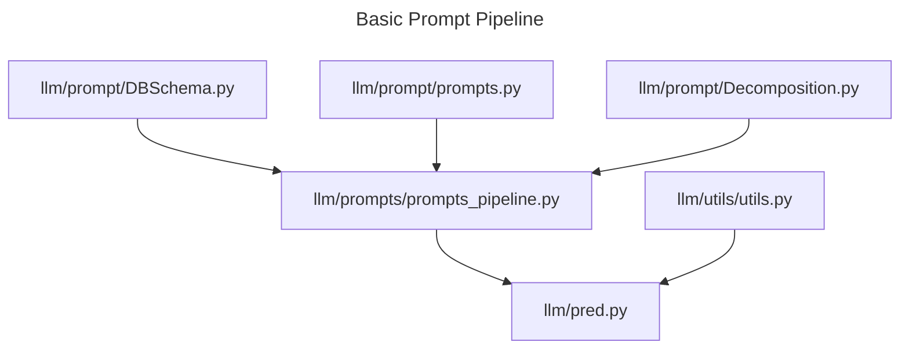
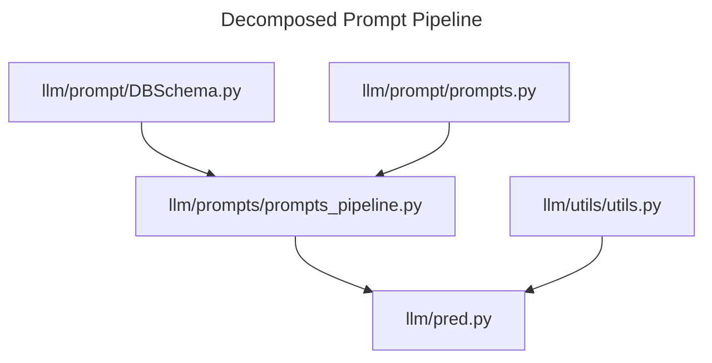
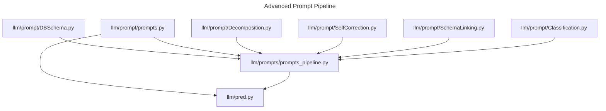

# Prompt Structure
There are two main types of prompts that can be used to generate SQL queries: Basic and Advanced. The basic pipeline is the simplest and most straightforward, that assumes the information is already provided in the prompt, like the tables to be used, the classification of the request, etc.
While the advanced pipeline is designed for a more complex and realistic scenario, where the model has to infer some of the information from the prompt itself. First, the logic verification step is performed, where the model has to verify if it understands the user request correctly. Then, the schema linking step is performed, where the model has to link the tables to the user request. Using the linked tables and the user request, the classification step is performed, where the model has to classify the user request into a specific task. Finally, the query generation step is performed, where the model has to generate the SQL query based on the information provided in the prompt.


There are two main types of prompts that can be used to generate SQL queries: Base or inference prompt and Decomposition prompt. The Base prompt is used to generate SQL queries directly from the user request given the model all the information needed to generate the query in a single prompt, while the Decomposition prompt is used to generate SQL queries by decomposing the user request into smaller tasks, and then using the decomposition plan to generate the SQL query. The Decomposition prompt is designed to be used in the advanced pipeline and to specify the prompt between types of queries (e.g., simple vs advanced queries) and to provide the model with more information about the user request, where the model has to infer some of the information from the prompt itself.

## Basic Pipeline
### Base Prompt
```
{general_task}

{general_db_context}

{table_schema}

{external_knowledge}

{user_request}
```

### Decomposition Prompt
#### Decompose Task
```
{decomposition_task}

{general_db_context}

{table_schema}

{user_request}
```
#### Generate SQL
```
{general_task}

{general_db_context}

{decomposition_plan}

{table_schema}

{external_knowledge}

{user_request}
```

# Advanced Pipeline
## Logic verification
```
{general_lv_task}

{user_request}
```

## Schema Linking
```
{general_sl_task}

{table_schema}

{user_request}
```


## Classification
```
{general_cl_task}

{general_db_context}

{table_schema}

{user_request}
```

## Query Generation
#### Base Prompt
```
{general_task}

{general_db_context}

{table_schema}

{external_knowledge}

{user_request}
```


### Decomposition Prompt
#### Decompose Task
```
{decomposition_task}

{general_db_context}

{table_schema}

{user_request}
```
#### Generate SQL
```
{general_task}

{general_db_context}

{decomposition_plan}

{table_schema}

{external_knowledge}

{user_request}
```








